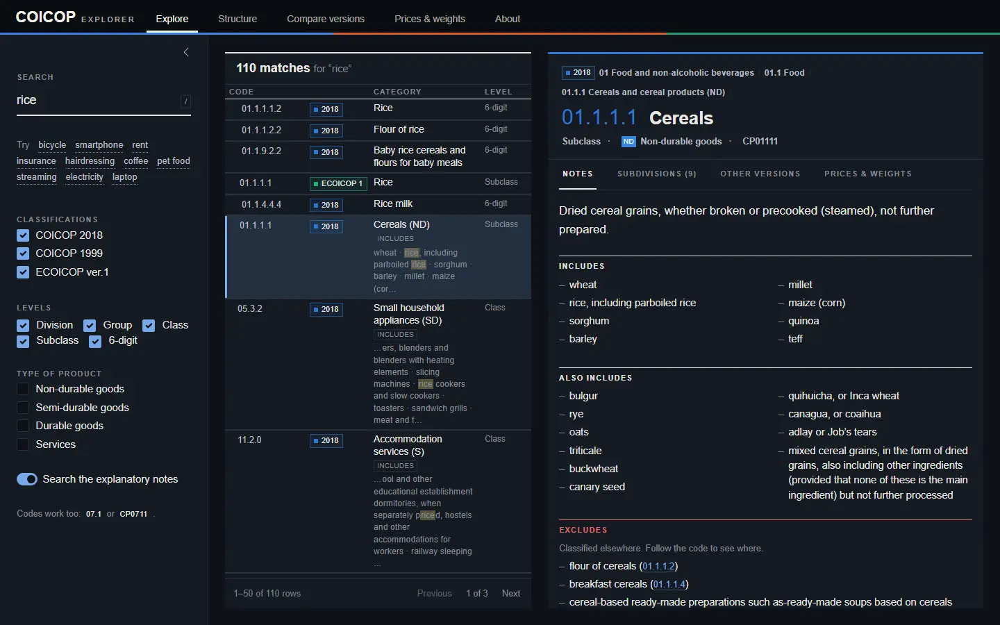
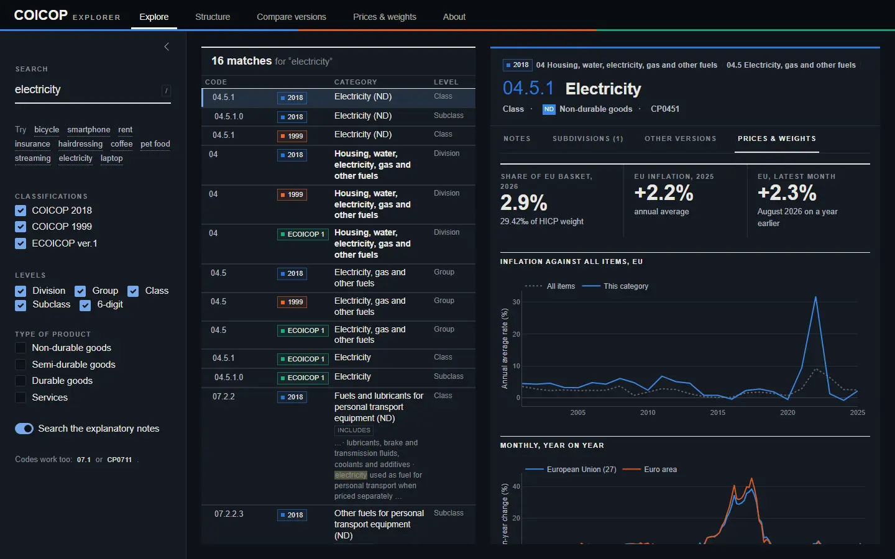
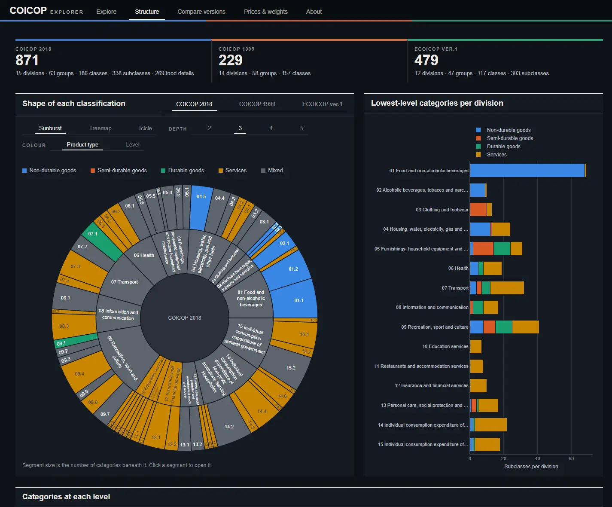
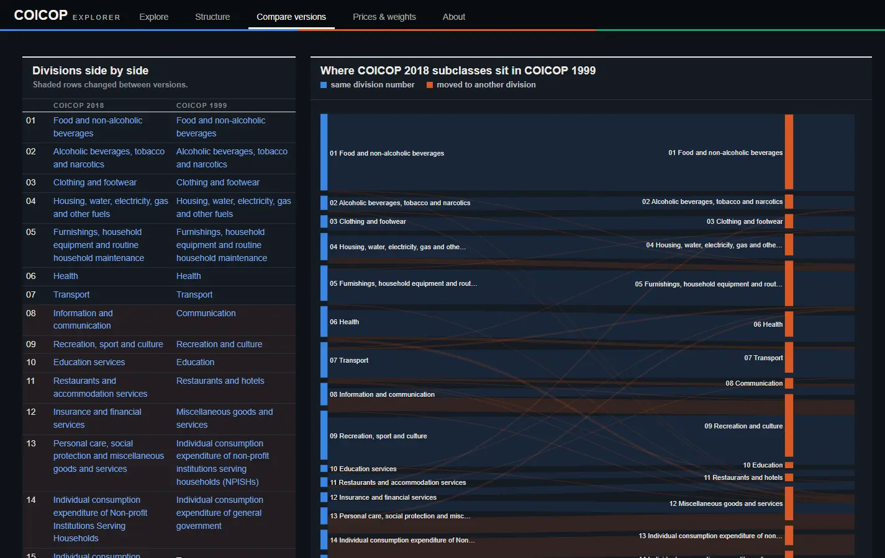
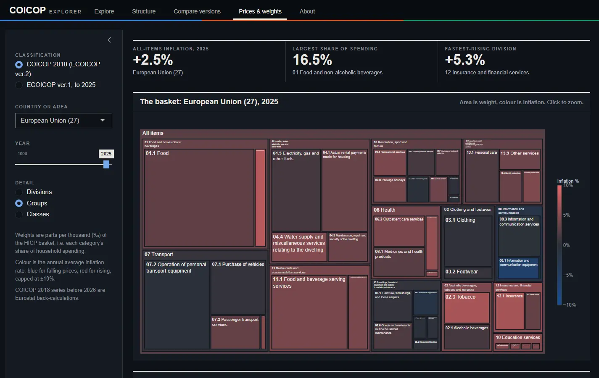

# COICOP Explorer

Search, browse and compare the UN **Classification of Individual Consumption According to Purpose**: COICOP 2018, COICOP 1999 and Eurostat's ECOICOP, with EU price and spending data. Lightweight R shiny app for self-hosting.


## Quick start

```bash
git clone https://github.com/<you>/coicop-explorer.git
cd coicop-explorer
Rscript run.R
```

That installs any missing packages and opens the app in your browser. In RStudio, open `coicop-explorer.Rproj` and click **Run App**.

Requires R 4.1 or later. The data is in the repo (`data/coicop.rds`, 1.6 MB), so it works offline.

## What you can do

- **Search everything at once**: by word (`pet food`, `smartphone`) or by code (`07.1`, `CP0711`). Matches inside the explanatory notes are highlighted.
- **Read the official notes**: what each category includes, also includes and excludes. Every code reference is a link.
- **Compare versions**: see where each COICOP 2018 category came from in COICOP 1999, using the UN correspondence table.
- **See the money**: EU basket weights, inflation by country, and monthly price changes for each category.

| | |
|---|---|
|  |  |
| **Prices & weights** for any category | **Structure** of each version |
|  |  |
| **What changed** between 1999 and 2018 | **What's in the basket**, by country and year |

## Versions included

| | Published by | Categories |
|---|---|---|
| **COICOP 2018** | UN Statistics Division | 871, including optional FAO food detail. Same codes as Eurostat's ECOICOP ver.2 (HICP from 2026) |
| **COICOP 1999** | UN Statistics Division | 229 |
| **ECOICOP ver.1** | Eurostat (HICP to 2025) | 479 |

## Updating the data

```bash
Rscript data-raw/download.R     # fetch the latest UN + Eurostat files
Rscript data-raw/build_data.R   # rebuild data/coicop.rds (needs readxl, data.table)
```

## Sources

- UN Statistics Division: [COICOP 2018 structure and notes, COICOP 1999 notes, 2018-1999 correspondence](https://unstats.un.org/unsd/classifications/Econ)
- Eurostat: [HICP item weights and inflation, ECOICOP code lists](https://ec.europa.eu/eurostat/web/hicp)

Data notes (back-cast series, ECOICOP title differences, how the notes were parsed) are on the app's **About** page.
